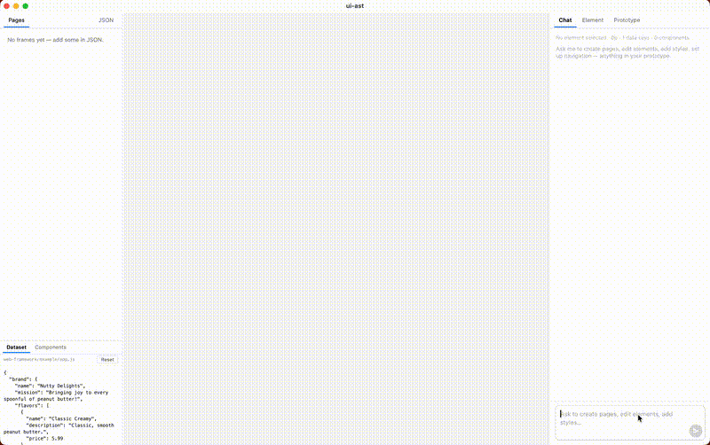

# design-agent-experiment

An AI-powered UI design tool that lets you visually build multi-page interfaces and edit them through a chat agent. Built with Tauri + React + TypeScript, using [pi-mono](https://github.com/mariozechner/pi-mono) for the agent loop.



---

## What it does

- **Visual canvas** — multi-frame layout with zoom/pan, click-to-select elements
- **Layer hierarchy** — inspect the DOM tree of any frame, click to highlight elements
- **Element inspector** — edit inline styles, classes, and content directly in the right panel
- **AI chat agent** — describe changes in plain language; the agent reads and rewrites page HTML/CSS
- **Prototype mode** — draw navigation links between frames by dragging between elements
- **Dataset + components** — live template variables (`{{key}}`) and reusable component library

---

## Setup

### Prerequisites

- [Node.js](https://nodejs.org/) 18+
- [Rust](https://www.rust-lang.org/tools/install) (for Tauri)
- [Tauri CLI prerequisites](https://tauri.app/start/prerequisites/) for your platform
- An [OpenRouter](https://openrouter.ai/) API key

### Install

```bash
cd desktop-application
npm install
```

### Configure environment

Create `desktop-application/.env`:

```env
VITE_OPENROUTER_API_KEY=your_openrouter_key_here
# Optional — defaults to openai/gpt-4o-mini
VITE_OPENROUTER_MODEL=openai/gpt-4o-mini
```

### Run (dev)

```bash
# Tauri desktop app (recommended)
cd desktop-application
npm run dev

# Web-only (no Tauri, opens in browser)
cd desktop-application
npm run vite
```

### Build

```bash
cd desktop-application
npm run tauri:build
```

---

## Project structure

```
ui-ast/
├── desktop-application/   # Tauri + Vite + React app
│   ├── src/
│   │   ├── App.tsx              # Main app: canvas, sidebars, state
│   │   ├── ChatPanel.tsx        # AI chat panel (pi-agent-core)
│   │   ├── ElementInspector.tsx # Right-panel element editor
│   │   ├── frameContent.ts      # iframe srcdoc builder + default frames
│   │   └── layers.ts            # DOM layer tree builder
│   ├── src-tauri/         # Tauri shell
│   └── .env               # API keys (not committed — see above)
└── web-framework/         # Supporting scripts/snapshots
```

---

## Tech

| Layer | Library |
|-------|---------|
| Desktop shell | [Tauri v2](https://tauri.app/) |
| UI | React 19 + TypeScript |
| Bundler | Vite |
| Agent loop | [@mariozechner/pi-agent-core](https://www.npmjs.com/package/@mariozechner/pi-agent-core) |
| LLM client | [@mariozechner/pi-ai](https://www.npmjs.com/package/@mariozechner/pi-ai) via OpenRouter |
